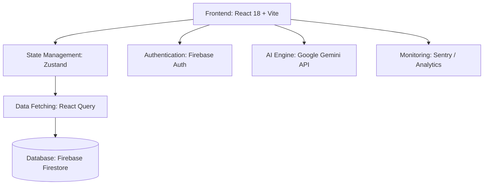

<div align="center">
  
# 🧠 NeuroNexus: The Centrist Mastery Platform

[](https://reactjs.org/)
[](https://vitejs.dev/)
[](https://tailwindcss.com/)
[](https://firebase.google.com/)
[](https://ai.google.dev/)
[](https://www.framer.com/motion/)

_An elite, AI-driven learning and assessment platform engineered with bleeding-edge technology, dynamic visual storytelling, and adaptive intelligence._

[**Explore the Features**](#-core-features) • [**Installation**](#-quick-start-guide) • [**Architecture**](#-technical-architecture)

---

</div>

<br />

## 🌠 Vision

NeuroNexus is more than a quiz app—it's an interactive neural network of knowledge. Utilizing advanced **Google Gemini AI**, NeuroNexus procedurally generates adaptive curriculum, robust assessments, and detailed analytics, all wrapped in a premium, hardware-accelerated user interface featuring micro-interactions and particle effects.

<br />

## ✨ Core Features

| Feature                     | Description                                                                                                                                 |
| :-------------------------- | :------------------------------------------------------------------------------------------------------------------------------------------ |
| **🤖 Generative AI Engine** | Powered by `@google/generative-ai`. Dynamically generates infinite unique quizzes, personalized feedback, and custom learning roadmaps.     |
| **🛡️ Elite Authentication** | Full Firebase Auth integration with Protected, Moderator, and Admin Routing. Robust Role-Based Access Control (RBAC).                       |
| **🗺️ Discovery Roadmaps**   | A highly visual, interactive "Hub" containing interactive learning nodes. Master concepts linearly with satisfying progression feedback.    |
| **⚡ Real-Time Data**       | Firestore integration synchronized globally through a custom Zustand store for blisteringly fast state management without prop-drilling.    |
| **🎨 Stunning UI / UX**     | Dark-mode native, "neuro-cyber" aesthetic featuring custom SVGs, ambient mesh gradients, and silky smooth `framer-motion` page transitions. |
| **📊 Advanced Analytics**   | Post-assessment dashboards equipped with granular metrics, tracking "Neural Links" formed and concept mastery levels.                       |

<br />

## 🛠️ Technical Architecture

NeuroNexus embraces a modern, decoupled React stack optimized for edge deployments and heavy interactive use.

### The Stack



- **Styling**: Tailwind CSS + custom arbitrary tokenization.
- **Routing**: `react-router-dom` v6 with intelligent splat routing and Auth Guards.
- **Validation**: `zod` schema parsing for AI safety and form integrity.

<br />

## 🚀 Quick Start Guide

Ready to spin up the local development server?

### Prerequisites

- Node.js (v18 or higher recommended)
- `npm` or `yarn`
- A Firebase Project (with Auth & Firestore enabled)
- A Google Gemini API Key

### 1. Clone the Repository

```bash
git clone https://github.com/yourusername/neuronexus.git
cd neuronexus
```

### 2. Install Dependencies

```bash
npm install
```

### 3. Environment Configuration

Create a `.env.local` file at the root of the project and populate it with your keys:

```env
# Firebase Configuration
VITE_FIREBASE_API_KEY="your-api-key"
VITE_FIREBASE_AUTH_DOMAIN="your-auth-domain"
VITE_FIREBASE_PROJECT_ID="your-project-id"
VITE_FIREBASE_STORAGE_BUCKET="your-storage-bucket"
VITE_FIREBASE_MESSAGING_SENDER_ID="your-messaging-id"
VITE_FIREBASE_APP_ID="your-app-id"

# AI Integration
VITE_GEMINI_API_KEY="your-gemini-key"
```

### 4. Ignite the Engines

```bash
npm run dev
```

Visit `http://localhost:5173` to experience the matrix.

<br />

## 📂 Project Structure

A glimpse into the neural pathways of the application:

<details>
<summary><b>Click to expand</b> directory tree</summary>
<br>
  
```text
src/
├── components/       # Reusable, atomic UI components (Navbar, Footers, Modals)
│   ├── AdminRoute.jsx    # Hardened route guarding for Admin panels
│   ├── ProtectedRoute.jsx# Auth requirement wrapper
│   └── ...
├── pages/            # View-level container components
│   ├── Dashboard.jsx     # User command center
│   ├── Generator.jsx     # AI interface
│   ├── Quiz.jsx          # Live testing environment
│   └── ...
├── store/            # Global state management
│   └── useStore.js       # Zustand logic execution
├── services/         # Third-party integrations & Business Logic
│   ├── firebase.js       # Firebase initialization
│   ├── SecurityService.js# Anti-tampering logic
│   └── DecisionLedger.js # Tracking algorithms
├── App.jsx           # Master layout & Route configuration
└── main.jsx          # Application entry point
```

</details>

<br />

## 🤝 Contributing

We welcome optimizations, UI enhancements, and new feature nodes.

1. Fork the Project
2. Create your Feature Branch (`git checkout -b feature/AmazingFeature`)
3. Commit your Changes (`git commit -m 'Add some AmazingFeature'`)
4. Push to the Branch (`git push origin feature/AmazingFeature`)
5. Open a Pull Request

---

<div align="center">
  <p>Engineered with precision. Designed for mastery.</p>
</div>
